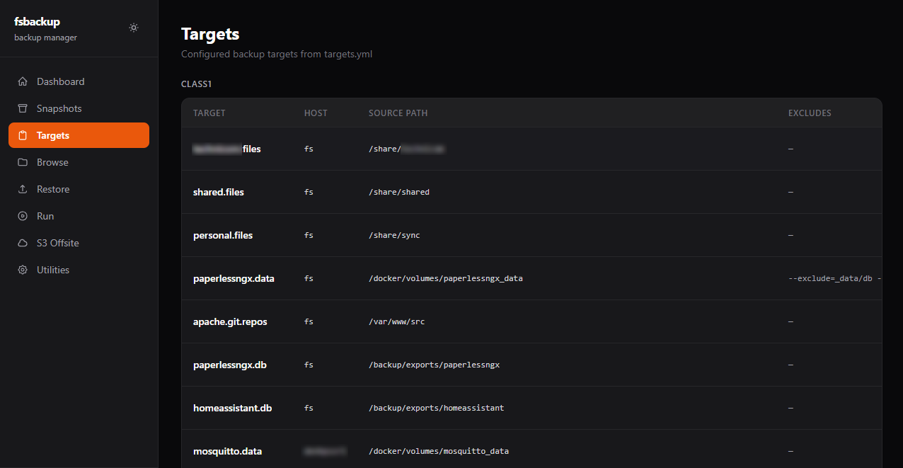
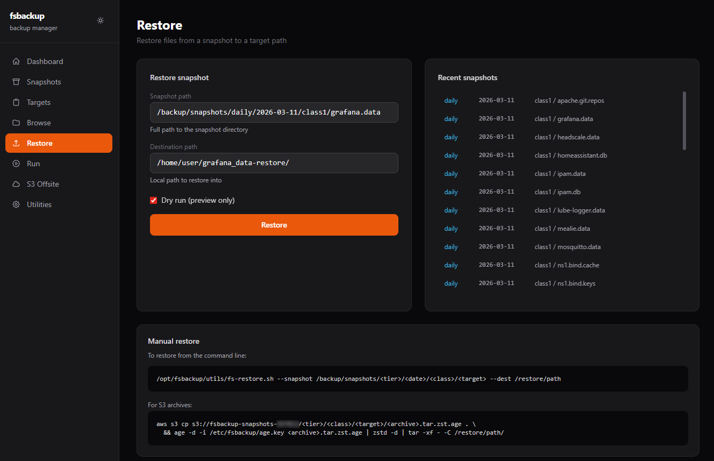
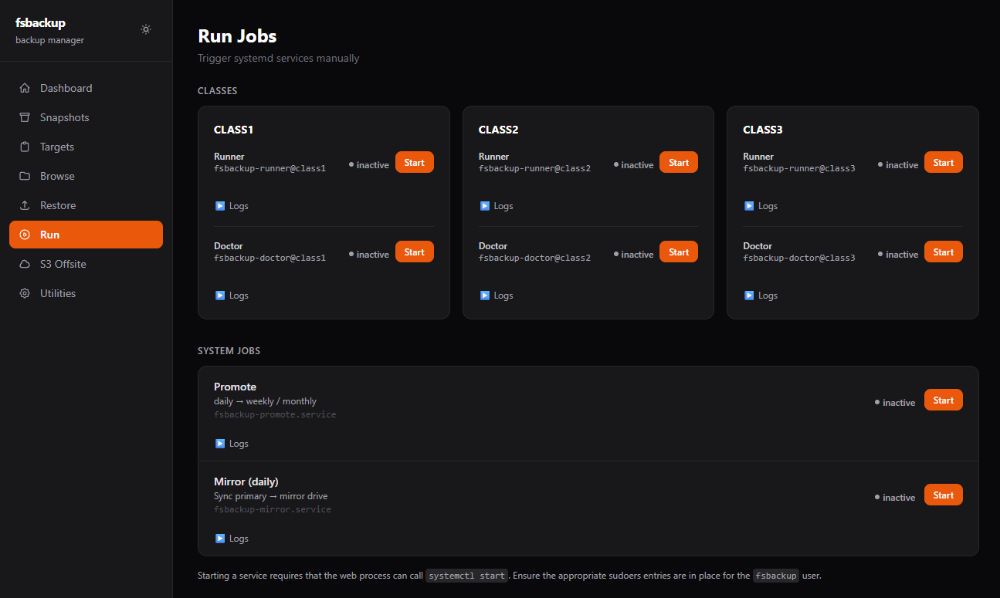
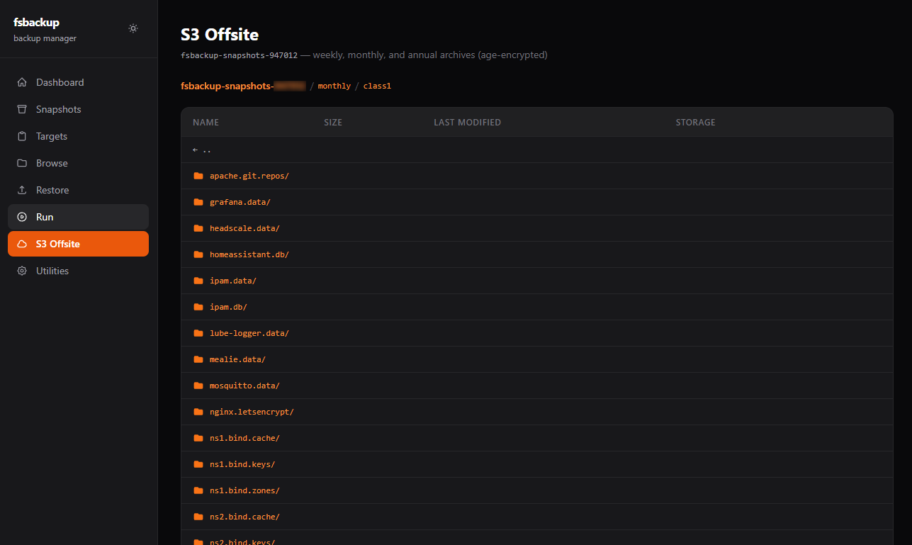
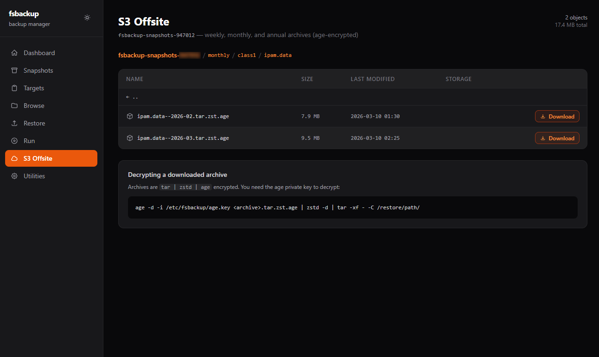

# fsbackup

fsbackup is a pull-based snapshot backup system for home lab Linux servers. The backup host connects outbound over SSH to each source host, pulls data with rsync, and stores point-in-time snapshots organized by date and tier. Snapshots are mirrored to a second local drive and optionally exported to encrypted offsite archives in S3. A [browser-based web UI](#web-ui) provides monitoring, snapshot browsing, and restore — including an S3 bucket browser.

fsbackup runs as a Docker container (supercronic scheduler + FastAPI web UI). See [Docker deployment](docs/docker.md) for setup instructions.

---

## Features

fsbackup is designed around the [3-2-1 backup rule](https://www.backblaze.com/blog/the-3-2-1-backup-strategy/): **3** copies of your data, on **2** different storage media, with **1** copy offsite. Primary snapshots live on the backup server's dedicated drive (copy 1), a second local drive holds a mirror (copy 2, separate media), and S3 export provides the offsite copy (copy 3).

- **Disk-to-disk snapshots over SSH** — pull-based rsync; the backup server initiates all connections, source hosts need no special configuration beyond a read-only `backup` user
- **Space-efficient snapshot storage** — each snapshot hardlinks unchanged files from the previous run via rsync `--link-dest`; a full snapshot tree costs only the space of changed files
- **Multi-tier retention** — daily snapshots promote automatically to weekly, monthly, and annual tiers; each tier is independently pruned on a configurable schedule
- **Mirror to a second drive** — all snapshots are rsynced to a secondary local drive for an additional layer of redundancy; per-class mirror exclusions are supported
- **Database export tool** — `fs-db-export.sh` dumps PostgreSQL, MySQL, and MariaDB databases to a staging directory before backup runs, ensuring the snapshot captures a consistent, closed database file rather than live data
- **Encrypted offsite export to S3** — weekly, monthly, and annual snapshots are compressed with zstd, encrypted end-to-end with [age](https://github.com/FiloSottile/age), and uploaded to Amazon S3; the private key never touches the backup server
- **S3 lifecycle management** — retention on S3 is handled entirely by prefix-based lifecycle rules; the export script never deletes anything
- **Web UI** — FastAPI + HTMX dashboard for monitoring backup health, browsing the snapshot tree, running jobs on demand, and initiating restores; includes an S3 bucket browser with one-click restore command generation
- **Prometheus metrics + Grafana dashboard** — every script emits textfile collector metrics covering snapshot size, file deltas, transfer bytes, exit codes, and timing; a pre-built Grafana dashboard is included
- **Health checks** — `fs-doctor.sh` verifies SSH connectivity, validates source paths, detects orphaned snapshot directories, and checks annual snapshot immutability before each backup window

---

## How it works

1. A `backup` user is created on each source host with read-only SSH access to the directories being backed up.
2. The backup host runs rsync over SSH, pulling data into dated snapshot directories.
3. Each new daily snapshot uses rsync's `--link-dest` option so unchanged files are hardlinked rather than copied, keeping storage usage low.
4. Older snapshots are promoted to weekly, monthly, and annual tiers on a schedule, then pruned when they age out.
5. The secondary drive (`/backup2`) is kept in sync as a mirror.
6. Prometheus metrics are written after each run so Grafana can show backup health at a glance.

---

## Table of contents

- [How it works](#how-it-works)
- [Web UI](#web-ui)
- [Repository layout](#repository-layout)
- [Data classes](#data-classes)
- [Snapshot layout](#snapshot-layout)
- [Scripts — automated](#scripts--automated-run-by-supercronic)
- [Scripts — manual use](#scripts--manual-use-administrative-utilities)
- [Remote scripts](#remote-scripts)
- [S3 cloud export](#s3-cloud-export)
- [Daily schedule](#daily-schedule)
- [Prometheus metrics](#prometheus-metrics)
- [Restore](#restore)
- [Restore from S3](#restore-from-s3)
- [Further reading](#further-reading)

---

## Web UI

fsbackup includes a browser-based UI for monitoring backup status, browsing snapshots, running jobs on demand, and initiating restores. It runs as a FastAPI + HTMX app on the backup server.

**Dashboard** — live status of all targets and recent run outcomes:


**Targets** — lists all configured targets with their class and host:



**Snapshots** — browse available snapshots by tier, class, and date:


**Browse** — explore the file tree inside any snapshot:


**Restore** — restore files from a snapshot to a local or remote path:



**Run jobs** — trigger runner or doctor jobs manually and follow the log output:



**S3 browse** — list what's in the S3 bucket by tier, class, and target:



**S3 download** — generate a download command for any S3 archive:



---

## Repository layout

```
bin/        Scripts run automatically by supercronic (scheduler inside the container)
docker/     Docker entrypoint script
utils/      Manual-use administrative tools
remote/     Scripts that run ON source hosts (not the backup server)
s3/         S3 cloud export
systemd/    Systemd unit files (reference only — not used in Docker deployment)
conf/       Configuration templates and examples
web/        FastAPI + HTMX web UI
docs/       Detailed documentation
```

---

## Data classes

Targets (individual backup jobs) are grouped into classes. Each class has its own schedule and retention policy.

| Class | What it covers | Schedule | Tiers |
|-------|---------------|----------|-------|
| class1 | Application data, databases, personal files | Daily | daily / weekly / monthly / annual |
| class2 | Infrastructure config (Docker stacks, nginx, DNS, etc.) | Daily | daily / weekly / monthly |
| class3 | Photo archives from `/share/pictures` | Monthly (1st of each month) | monthly only |

class3 is not mirrored to the secondary drive (too large; backed up separately to M-DISC and USB).

---

## Snapshot layout

Snapshots are stored under `/backup/snapshots/` and mirrored to `/backup2/snapshots/`.

```
/backup/snapshots/
  daily/    YYYY-MM-DD/
              class1/<target>/
              class2/<target>/
  weekly/   YYYY-Www/          (e.g. 2026-W09)
              class1/<target>/
              class2/<target>/
  monthly/  YYYY-MM/
              class1/<target>/
              class2/<target>/
              class3/<target>/
  annual/   YYYY/              (class1 only, promoted each January from prior December)
              class1/<target>/
```

---

## Scripts — automated (run by supercronic)

These scripts are called by supercronic on a schedule. You generally don't run them by hand, though you can pass `--dry-run` to test without making changes. To run manually: `docker exec -it fsbackup /opt/fsbackup/bin/<script> ...`

Repository path: **bin/**

| Filename | Name | Description |
|----------|------|-------------|
| `fs-runner.sh` | Take a snapshot | Connects to each target over SSH and rsyncs a new snapshot. Unchanged files are hardlinked to the previous snapshot. Writes Prometheus metrics. |
| `fs-doctor.sh` | Health check | Checks SSH connectivity, source paths, and snapshot directories. Reports orphaned targets and verifies snapshot immutability. |
| `fs-promote.sh` | Promote snapshots | Promotes qualifying daily snapshots to weekly and weekly to monthly. Runs nightly after the backup cycle. |
| `fs-annual-promote.sh` | Annual promotion | Promotes the prior December monthly snapshot to the `annual/` tier (class1 only). Runs January 5th. |
| `fs-retention.sh` | Prune old snapshots | Deletes snapshots past retention limits on primary storage (14d daily / 8w weekly / 12m monthly). |
| `fs-mirror.sh` | Sync to mirror drive | Rsyncs primary snapshots to the secondary drive. Runs in `daily` or `promote` mode. Skips classes in `MIRROR_SKIP_CLASSES`. |
| `fs-mirror-retention.sh` | Prune mirror snapshots | Prunes old snapshots on the mirror drive (14d / 12w / 24m). |
| `fs-db-export.sh` | Export databases | Dumps databases via `docker exec` to an export directory before backup runs, ensuring a consistent snapshot. Requires Docker socket mount. |
| `fs-logrotate-metric.sh` | Logrotate health metric | Checks that logrotate ran and writes a Prometheus metric for alerting. |

---

## Scripts — manual use (administrative utilities)

These tools are run by hand when needed. They are not wired to any timer.

Repository path: **utils/**

| Filename | Name | Description | Parameters |
|----------|------|-------------|------------|
| `fs-restore.sh` | Restore files | Browse available snapshots and restore files to a local path or push to a remote host over SSH. See the [Restore](#restore) section for full usage. | `list --type <tier> [--class <class>] [--date <key>]`; `restore --type <tier> --class <class> --id <id> [--date <key>\|--latest] --to <path>` |
| `fs-trust-host.sh` | Seed SSH host keys | Adds a host's SSH key to the backup user's `known_hosts`. Run once when adding a new host. | `<hostname>` |
| `fs-nodeexp-fix.sh` | Fix metric file permissions | Repairs ownership and permissions on node_exporter textfile collector files if they become unreadable. Optionally grants read ACLs to the web UI user. | `[--web-user <username>]` |
| `fs-annual-mirror-check.sh` | Verify annual mirror sync | Checks that annual snapshots on the primary drive are present on the mirror. Run after the January annual promotion. | none |
| `fs-target-rename.sh` | Rename a target | Renames a target directory across all snapshot tiers on both primary and mirror storage. Use when a target ID changes in `targets.yml`. | `--class <class> --from <old-id> --to <new-id> --move\|--delete` |

---

## Remote scripts

These scripts are deployed to and run **on the source hosts**, not the backup server.

Repository path: **remote/**

| Filename | Name | Description | Parameters |
|----------|------|-------------|------------|
| `fsbackup_remote_init.sh` | Set up source host | Creates the `backup` user, configures SSH authorized keys, and sets read-only ACLs on paths to be backed up. Run once per new source host. | `--pubkey-file <file>` or `--pubkey <key>`, `--backup-user <user>`, `--allow-path <path>` (repeatable) |
| `fs-prometheus-prebackup.sh` | Prometheus pre-backup snapshot | Calls the Prometheus HTTP API to snapshot its data directory before backup runs. Deploy and run on the host running Prometheus. | none |
| `fs-victoriametrics-prebackup.sh` | VictoriaMetrics pre-backup snapshot | Calls the VictoriaMetrics API to snapshot its data directory before backup runs. Deploy and run on the host running VictoriaMetrics. | none |

---

## S3 cloud export

`s3/fs-export-s3.sh` compresses, encrypts, and uploads snapshots to Amazon S3 for offsite storage. Weekly, monthly, and annual snapshots are exported; daily snapshots and class3 are not. Files are encrypted with [age](https://github.com/FiloSottile/age) before upload so S3 never holds readable data. Retention is managed entirely by S3 lifecycle rules — the script never deletes anything.

Called by: supercronic at 04:30 daily, after mirror-promote.

### S3 setup

These steps are required once before enabling the timer.

**1. Generate the age keypair**

Run on the backup server:

```bash
age-keygen 2>/dev/null | grep "public key"   # prints the public key
age-keygen -o /tmp/age.key                   # writes the private key file
sudo cp /tmp/age.key.pub /etc/fsbackup/age.pub
sudo chown fsbackup:fsbackup /etc/fsbackup/age.pub
rm /tmp/age.key   # delete private key from server
```

Store the private key in a password manager or print it and keep it somewhere safe — **not on the backup server**. You only need it to decrypt a restored archive.

**2. Create the S3 bucket**

Replace `SUFFIX` with the last 6 digits of your AWS account ID. Run from any machine with admin AWS credentials:

```bash
BUCKET="fsbackup-snapshots-SUFFIX"
REGION="us-west-2"    # or your preferred region

aws s3api create-bucket --bucket "$BUCKET" --region "$REGION" \
  --create-bucket-configuration LocationConstraint="$REGION"

aws s3api put-public-access-block --bucket "$BUCKET" \
  --public-access-block-configuration \
  "BlockPublicAcls=true,IgnorePublicAcls=true,BlockPublicPolicy=true,RestrictPublicBuckets=true"

aws s3api put-bucket-encryption --bucket "$BUCKET" \
  --server-side-encryption-configuration \
  '{"Rules":[{"ApplyServerSideEncryptionByDefault":{"SSEAlgorithm":"AES256"},"BucketKeyEnabled":true}]}'

aws s3api put-bucket-versioning --bucket "$BUCKET" \
  --versioning-configuration Status=Enabled
```

**3. Set lifecycle rules**

S3 handles expiration automatically via prefix-based rules. No script ever deletes objects.

```bash
aws s3api put-bucket-lifecycle-configuration \
  --bucket "$BUCKET" \
  --lifecycle-configuration '{
    "Rules": [
      {
        "ID": "expire-weekly",
        "Status": "Enabled",
        "Filter": {"Prefix": "weekly/"},
        "Expiration": {"Days": 84}
      },
      {
        "ID": "expire-monthly",
        "Status": "Enabled",
        "Filter": {"Prefix": "monthly/"},
        "Expiration": {"Days": 450}
      },
      {
        "ID": "abort-incomplete-multipart",
        "Status": "Enabled",
        "Filter": {"Prefix": ""},
        "AbortIncompleteMultipartUpload": {"DaysAfterInitiation": 3}
      }
    ]
  }'
```

Objects under `annual/` have no expiration rule and are kept indefinitely. The `abort-incomplete-multipart` rule automatically cleans up abandoned upload parts (from interrupted uploads) within 3 days, preventing orphaned data from accumulating in the bucket and incurring storage charges.

**4. Create the IAM policy and upload user**

In the AWS Console: IAM → Policies → Create policy → paste this JSON (replace `SUFFIX`):

```json
{
  "Version": "2012-10-17",
  "Statement": [
    {
      "Effect": "Allow",
      "Action": ["s3:PutObject", "s3:GetObject", "s3:ListBucket"],
      "Resource": [
        "arn:aws:s3:::fsbackup-snapshots-SUFFIX",
        "arn:aws:s3:::fsbackup-snapshots-SUFFIX/*"
      ]
    }
  ]
}
```

Name it `fsbackup-uploader-policy`. Then: IAM → Users → Create user → name `fsbackup-uploader` → attach that policy → Create access key (type: "Application running outside AWS").

**5. Configure credentials on the backup server**

```bash
sudo -u fsbackup aws configure --profile fsbackup
# Enter the key ID and secret from the step above
# Region: us-west-2 (or your region)
# Output format: json
```

Test it:

```bash
sudo -u fsbackup aws s3 ls s3://fsbackup-snapshots-SUFFIX --profile fsbackup
```

**6. Update fsbackup.conf**

Add to `/etc/fsbackup/fsbackup.conf`:

```bash
S3_BUCKET="fsbackup-snapshots-SUFFIX"
S3_SKIP_CLASSES="class3"
```

The S3 export runs automatically via supercronic at 04:30 daily once the container is running.

---

## Daily schedule

| Time | Job |
|------|-----|
| 01:17 | Doctor — class1 |
| 01:40 | DB export — paperlessngx |
| 01:49 | Runner — class1 |
| 02:05 | Doctor — class2 |
| 02:15 | Runner — class2 |
| 02:30 | Mirror — daily sync |
| 03:00 | Retention |
| 03:30 | Promote |
| 03:40 | Mirror — post-promote sync |
| 04:00 | Mirror retention |
| 04:30 | S3 export |

class3 (photos) runs on the 1st of each month: doctor at 04:15, runner at 04:45.

Annual promotion runs once per year on January 5th.

---

## Prometheus metrics

All metrics are written as textfile collector `.prom` files to `/var/lib/node_exporter/textfile_collector/` and scraped by node_exporter. All metrics are type `gauge` unless noted.

### Snapshot metrics (`fs-runner.sh`)

These are written per-target after each snapshot run.

| Metric | Labels | Description |
|--------|--------|-------------|
| `fsbackup_snapshot_last_success` | `class`, `target` | Unix timestamp of the last successful snapshot |
| `fsbackup_snapshot_last_failure` | `class`, `target` | Unix timestamp of the last failed snapshot attempt |
| `fsbackup_snapshot_bytes` | `class`, `target` | Total size of the snapshot directory in bytes (via `du`) |
| `fsbackup_snapshot_files_total` | `class`, `target` | Total number of files in the snapshot |
| `fsbackup_snapshot_files_created` | `class`, `target` | Files added compared to the previous snapshot |
| `fsbackup_snapshot_files_deleted` | `class`, `target` | Files removed compared to the previous snapshot |
| `fsbackup_snapshot_transferred_bytes` | `class`, `target` | Bytes actually changed and transferred (the true delta; excludes hardlinked unchanged files) |
| `fsbackup_runner_target_last_seen` | `class`, `target` | Unix timestamp of the last run attempt, success or failure |
| `fsbackup_runner_target_last_exit_code` | `class`, `target` | rsync exit code of the last run (0 = success) |
| `fsbackup_runner_target_failures_total` | `class`, `target` | Monotonically increasing failure count per target (counter; resets on process restart) |
| `fsbackup_runner_success` | `class` | Number of targets that succeeded in the last full class run |
| `fsbackup_runner_failed` | `class` | Number of targets that failed in the last full class run |
| `fsbackup_runner_last_exit_code` | `class` | Overall exit code for the class run (0 = all succeeded, 1 = any failed) |
| `fsbackup_runner_run_scope` | `class` | 1 = full class run, 0 = single-target run (affects whether class-level metrics were updated) |

### Doctor metrics (`fs-doctor.sh`)

Written after each doctor run.

| Metric | Labels | Description |
|--------|--------|-------------|
| `fsbackup_orphan_snapshots_total` | `root` | Count of snapshot directories belonging to targets no longer in `targets.yml`. Root is `primary` or `mirror`. Alert if > 0. |
| `fsbackup_annual_immutable` | `root` | 1 if all annual snapshot directories are immutable (chattr +i), 0 if any are writable. Root is `primary` or `mirror`. |
| `fsbackup_doctor_duration_seconds` | `class` | How long the doctor run took, in seconds |

### Mirror metrics (`fs-mirror.sh`)

Written after each mirror run. Mode is `daily` or `promote`.

| Metric | Labels | Description |
|--------|--------|-------------|
| `fsbackup_mirror_last_success` | `mode` | Unix timestamp of the last mirror run |
| `fsbackup_mirror_last_exit_code` | `mode` | Exit code of the last mirror run (0 = success) |
| `fsbackup_mirror_bytes_total` | `mode` | Total bytes present in the mirrored scope after the run |
| `fsbackup_mirror_duration_seconds` | `mode` | Duration of the mirror run in seconds |

### S3 export metrics (`fs-export-s3.sh`)

Written after each S3 export run.

| Metric | Labels | Description |
|--------|--------|-------------|
| `fsbackup_s3_last_success` | — | Unix timestamp of the last S3 export run completion |
| `fsbackup_s3_last_exit_code` | — | 0 if all uploads succeeded, 1 if any failed |
| `fsbackup_s3_uploaded_total` | — | Number of archives uploaded in this run |
| `fsbackup_s3_skipped_total` | — | Number of archives skipped because they already existed in S3 |
| `fsbackup_s3_failed_total` | — | Number of archives that failed to upload |
| `fsbackup_s3_bytes_total` | — | Bytes uploaded in this run |
| `fsbackup_s3_duration_seconds` | — | Duration of the S3 export run in seconds |
| `fsbackup_s3_target_last_upload` | `tier`, `class`, `target` | Unix timestamp of the last successful S3 upload for this target |
| `fsbackup_s3_target_last_failure` | `tier`, `class`, `target` | Unix timestamp of the last S3 upload failure for this target |

### Logrotate health (`fs-logrotate-metric.sh`)

| Metric | Labels | Description |
|--------|--------|-------------|
| `fsbackup_logrotate_ok` | — | 1 if the fsbackup logrotate config validates cleanly, 0 if there is an error |
| `fsbackup_logrotate_last_run_seconds` | — | Unix timestamp of the last logrotate health check |

---

## Restore

Use `utils/fs-restore.sh` via `docker exec` or directly as the `fsbackup` user. Restored files land in `/restore` inside the container, which maps to `/backup/restore` on the host.

### Browse available snapshots

```bash
# List available date keys for a tier
fs-restore.sh list --type daily
fs-restore.sh list --type weekly
fs-restore.sh list --type monthly

# List classes under a specific date key
fs-restore.sh list --type daily --date 2026-02-27

# List targets under a specific date and class
fs-restore.sh list --type daily   --date 2026-02-27  --class class2
fs-restore.sh list --type weekly  --date 2026-W09    --class class1
fs-restore.sh list --type monthly --date 2026-02     --class class1
```

### Restore to a local path

```bash
# Restore the most recent daily snapshot to /restore/nginx (→ /backup/restore/nginx on host)
docker exec -it fsbackup /opt/fsbackup/utils/fs-restore.sh restore \
  --type daily --class class2 --id nginx.data \
  --latest \
  --to /restore/nginx

# Restore from a specific date
docker exec -it fsbackup /opt/fsbackup/utils/fs-restore.sh restore \
  --type weekly --class class2 --id ns1.bind.named.conf \
  --date 2026-W09 \
  --to /restore/bind
```

### Restore directly to a remote host

The script rsyncs the snapshot to `backup@<host>:<path>` over SSH using the same key the runner uses. The destination path is created if it does not exist.

```bash
# Restore bind config to ns1 at a staging path
docker exec -it fsbackup /opt/fsbackup/utils/fs-restore.sh restore \
  --type daily --class class2 --id ns1.bind.named.conf \
  --latest \
  --to-host ns1 --to-path /tmp/restore-bind

# Restore from a specific weekly snapshot to ns2
docker exec -it fsbackup /opt/fsbackup/utils/fs-restore.sh restore \
  --type weekly --class class2 --id ns2.bind.named.conf \
  --date 2026-W09 \
  --to-host ns2 --to-path /tmp/restore-bind
```

### Restore flags reference

| Flag | Required | Description |
|------|----------|-------------|
| `--type` | yes | `daily`, `weekly`, `monthly`, or `annual` |
| `--class` | yes (restore) | `class1`, `class2`, `class3` |
| `--id` | yes (restore) | Target name as shown in `list` output |
| `--latest` | one of | Use the most recent available snapshot |
| `--date` | one of | Explicit snapshot key (`2026-02-27`, `2026-W09`, `2026-02`, `2026`) |
| `--to` | one of | Local destination directory |
| `--to-host` + `--to-path` | one of | Remote host and path (rsync over SSH) |

### Exit codes

| Code | Meaning |
|------|---------|
| 0 | Success |
| 2 | Argument error |
| 4 | Snapshot not found |

---

## Restore from S3

S3 archives are stored as encrypted, compressed tar archives. You need:
- The age **private key** (stored off-server — password manager, printed copy, etc.)
- The `age`, `zstd`, and `aws` CLI tools
- AWS credentials with `GetObject` and `ListBucket` permissions

### Browse what's in S3

```bash
# List all tiers
aws s3 ls s3://fsbackup-snapshots-SUFFIX/ --profile fsbackup

# List all snapshots for a tier
aws s3 ls s3://fsbackup-snapshots-SUFFIX/weekly/ --recursive --profile fsbackup

# List snapshots for a specific class and target
aws s3 ls s3://fsbackup-snapshots-SUFFIX/weekly/class1/paperlessngx.db/ --profile fsbackup
```

### Download and decrypt an archive

```bash
# Download the archive
aws s3 cp \
  s3://fsbackup-snapshots-SUFFIX/weekly/class1/paperlessngx.db/paperlessngx.db--2026-W09.tar.zst.age \
  /tmp/restore/ \
  --profile fsbackup

# Decrypt, decompress, and extract to a local directory
age -d -i /path/to/age.key /tmp/restore/paperlessngx.db--2026-W09.tar.zst.age \
  | zstd -d \
  | tar -xf - -C /tmp/restore/paperlessngx.db/
```

### Stream directly without downloading first

If the archive is large and you don't want to save the encrypted file locally:

```bash
aws s3 cp \
  s3://fsbackup-snapshots-SUFFIX/weekly/class1/paperlessngx.db/paperlessngx.db--2026-W09.tar.zst.age \
  - --profile fsbackup \
  | age -d -i /path/to/age.key \
  | zstd -d \
  | tar -xf - -C /tmp/restore/paperlessngx.db/
```

### S3 archive naming and key structure

```
s3://fsbackup-snapshots-SUFFIX/
  <tier>/
    <class>/
      <target>/
        <target>--<date>.tar.zst.age
```

Examples:
```
weekly/class1/paperlessngx.db/paperlessngx.db--2026-W09.tar.zst.age
monthly/class2/nginx.config/nginx.config--2026-03.tar.zst.age
annual/class1/homeassistant.db/homeassistant.db--2025.tar.zst.age
```

---

## Further reading

- [Docker deployment](docs/docker.md)
- [Installation](docs/installation.md)
- [Adding hosts and targets](docs/adding-hosts-and-targets.md)
- [Operations guide](docs/operations.md)
- [Restore guide](docs/restore.md)
- [Reference](docs/reference.md)

---

## License

MIT — Copyright (c) 2026 Ian Kluhsman
