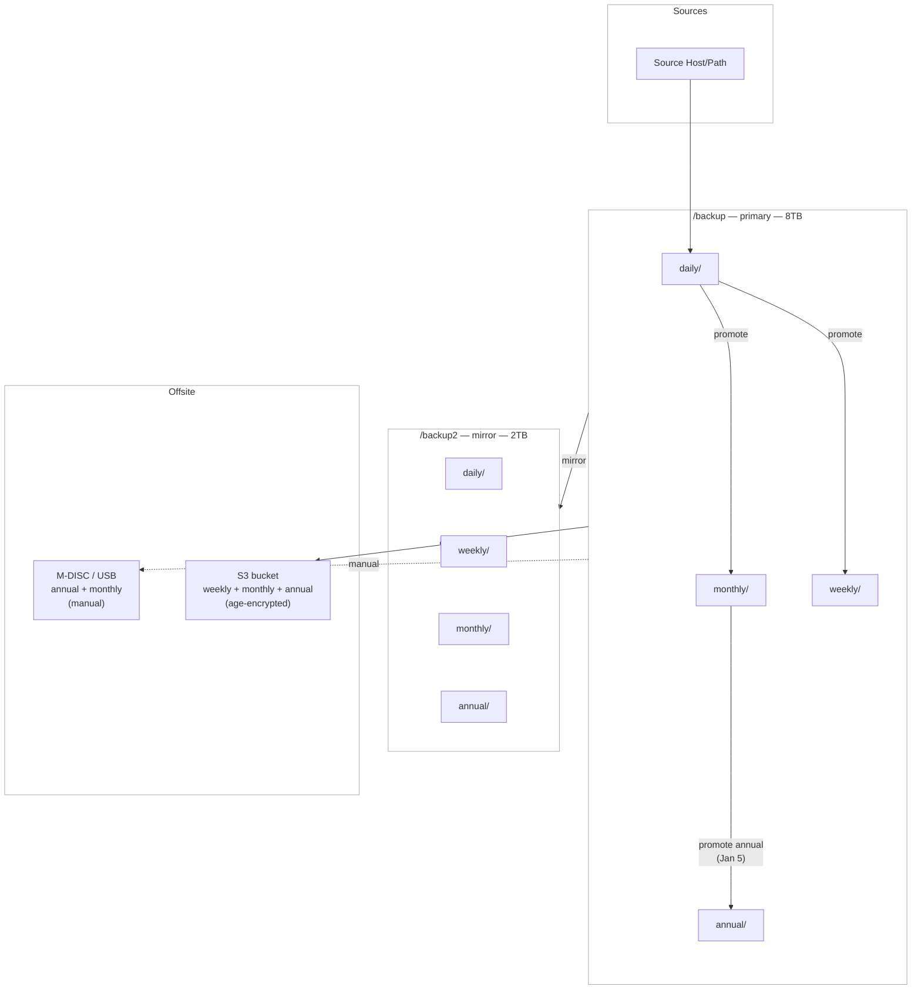

# fsbackup — System Overview

fsbackup is a pull-based, disk-to-disk snapshot backup system built on rsync and
systemd. The backup server connects out to each source host over SSH and pulls data
inward. Snapshots are organized into tiers, mirrored to a secondary drive, and
selectively exported offsite.

---

## How it works

**Snapshot pull**: the backup server initiates an SSH connection to each source host and
runs rsync to pull the target directory into a local snapshot. Source hosts never push —
they only need a `backup` user with the appropriate authorized key and read ACLs on the
paths being backed up.

**Tiers**: each snapshot run writes to a dated directory under a tier (`daily`,
`weekly`, `monthly`, `annual`). Promotion copies daily snapshots forward into the weekly
and monthly tiers using `rsync --link-dest`, which hard-links unchanged files so each
tier looks like a complete copy while consuming only incremental disk space. Annual
snapshots are promoted once a year from December monthly snapshots and made read-only.

**Mirror**: after each run the primary snapshots are mirrored to a second drive using
the same rsync hard-link approach, giving a physically separate on-site copy without
doubling raw storage.

**Offsite**: weekly, monthly, and annual snapshots are exported to S3 as
`tar | zstd | age`-encrypted archives. M-DISC and USB are available for manual
cold-storage copies.

**Classes** group targets by data type and snapshot frequency. The data flow through
each stage (primary → mirror → offsite) is identical regardless of class — class only
determines which targets run together and how often.

---

## Data flow

---

## Features

- **SSH pull**: the backup server initiates all connections; source hosts require no
  outbound access and no backup agent software beyond a dedicated `backup` user
- **Hard-linked tiers**: daily → weekly → monthly → annual promotion via
  `rsync --link-dest`; each tier is a complete consistent snapshot, incremental on disk
- **Idempotent runs**: safe to re-run at any time; existing content is not re-transferred
  unless `--replace-existing` is specified
- **Per-target granularity**: individual targets can be re-run, skipped, or excluded
  without affecting other targets in the same class
- **Mirror**: secondary on-site copy on a separate physical drive, with independent
  retention; `MIRROR_SKIP_CLASSES` excludes classes from mirroring (e.g. large photo
  archives)
- **S3 export**: weekly/monthly/annual snapshots uploaded as compressed, encrypted
  archives; idempotent (skips already-uploaded objects); IAM policy limits the upload
  user to PutObject/GetObject/ListBucket only — no delete
- **Database pre-export**: MariaDB/MySQL and PostgreSQL databases running in Docker can
  be dumped to a local export directory before the snapshot run picks them up
- **Prometheus metrics**: all scripts emit `.prom` files consumed by node_exporter;
  full Grafana dashboard included
- **Doctor**: pre-run health check that verifies SSH reachability, source path
  existence, orphan detection, and annual snapshot immutability

---

## Supported database exports

`fs-db-export.sh` connects to a Docker container and exports a database to a
compressed `.sql.gz` file. The export directory is then picked up by the regular
rsync snapshot run.

| Engine | Method |
|--------|--------|
| MariaDB / MySQL | `docker exec` → `mariadb-dump` |
| PostgreSQL | `docker exec` → `pg_dump` |

Credentials and container details are stored in per-database `.env` files under
`/etc/fsbackup/db/`. See `conf/db.env.example` for the required variables.

---

## Prometheus metrics

All scripts write `.prom` files to the node_exporter textfile collector directory
(`/var/lib/node_exporter/textfile_collector/`). These are picked up on the next
node_exporter scrape and exposed to Prometheus without any additional configuration.

**Runner metrics** (one file per class, e.g. `fsbackup_runner_class1.prom`):

| Metric | Description |
|--------|-------------|
| `fsbackup_snapshot_last_success{class,target}` | Unix timestamp of last successful snapshot |
| `fsbackup_snapshot_bytes{class,target}` | Total size of snapshot directory in bytes |
| `fsbackup_snapshot_files_total{class,target}` | File count from last rsync run |
| `fsbackup_snapshot_files_created{class,target}` | Files added in last run |
| `fsbackup_snapshot_files_deleted{class,target}` | Files removed in last run |
| `fsbackup_snapshot_transferred_bytes{class,target}` | Bytes transferred in last run |
| `fsbackup_runner_target_last_exit_code{class,target}` | rsync exit code (0 = success, 255 = SSH failure) |
| `fsbackup_runner_target_failures_total{class,target}` | Cumulative failure count since last success |
| `fsbackup_runner_last_exit_code{class}` | 0 if all targets succeeded, 1 if any failed |

**Doctor metrics** (`fsbackup_doctor_<class>.prom`):

| Metric | Description |
|--------|-------------|
| `fsbackup_doctor_ssh_ok{class,target,host}` | 1 if SSH connection to host succeeded |
| `fsbackup_doctor_path_ok{class,target,host}` | 1 if source path exists on remote host |
| `fsbackup_orphan_snapshots_total{root}` | Count of snapshot directories with no matching target |
| `fsbackup_annual_immutable{root}` | 1 if all annual snapshots are read-only (immutable) |
| `fsbackup_doctor_duration_seconds{class}` | Wall-clock seconds the doctor run took |
| `fsbackup_node_exporter_textfile_access` | 1 if the textfile collector directory is writable |

**Mirror metrics** (`fsbackup_mirror_<mode>.prom`):

| Metric | Description |
|--------|-------------|
| `fsbackup_mirror_last_success{mode}` | Unix timestamp of last successful mirror run |
| `fsbackup_mirror_last_exit_code{mode}` | 0 if mirror succeeded, 1 if any rsync failed |
| `fsbackup_mirror_bytes_total{mode}` | Bytes transferred in last mirror run |
| `fsbackup_mirror_duration_seconds{mode}` | Wall-clock seconds the mirror run took |

`mode` is `daily` or `promote`.

**DB export metrics** (`fsbackup_db_export.prom`):

| Metric | Description |
|--------|-------------|
| `fsbackup_db_export_success{db,engine,host}` | 1 if the last export succeeded, 0 if it failed |
| `fsbackup_db_export_last_timestamp{db,engine,host}` | Unix timestamp of last successful export |
| `fsbackup_db_export_size_bytes{db,engine,host}` | Compressed size of the export file in bytes |

**Logrotate metric** (`fsbackup_logrotate.prom`):

| Metric | Description |
|--------|-------------|
| `fsbackup_logrotate_ok` | 1 if logrotate ran cleanly on last check, 0 if it errored |
| `fsbackup_logrotate_last_run_seconds` | Unix timestamp of last logrotate check |

**S3 export metrics** (`fsbackup_s3_export.prom`):

| Metric | Description |
|--------|-------------|
| `fsbackup_s3_target_last_upload{tier,class,target}` | Unix timestamp of last successful upload for this target |
| `fsbackup_s3_target_last_failure{tier,class,target}` | Unix timestamp of last failed upload for this target |
| `fsbackup_s3_last_success` | Unix timestamp of last run where all uploads succeeded |
| `fsbackup_s3_last_exit_code` | 0 if all targets succeeded, 1 if any failed |
| `fsbackup_s3_uploaded_total` | Count of archives uploaded in last run |
| `fsbackup_s3_skipped_total` | Count of archives skipped (already present in S3) |
| `fsbackup_s3_failed_total` | Count of archives that failed to upload |
| `fsbackup_s3_bytes_total` | Total bytes uploaded in last run |
| `fsbackup_s3_duration_seconds` | Wall-clock seconds the S3 export run took |

A Grafana dashboard is included at `conf/grafana-dashboard.json`. The datasource UID
in that file is instance-specific and must be remapped on import.
