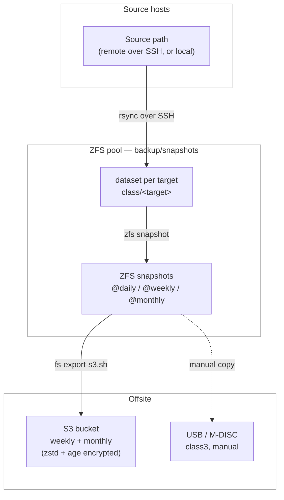

# fsbackup — System Overview

fsbackup is a pull-based, disk-to-disk snapshot backup system built on ZFS, rsync, and
systemd. The backup server connects out to each source host over SSH and pulls data
inward into a per-target ZFS dataset, then takes a ZFS snapshot. Selected snapshots are
exported offsite to S3 as encrypted archives.

---

## How it works

**Snapshot pull**: the backup server initiates an SSH connection to each source host and
runs rsync to pull the target directory into that target's ZFS dataset
(`backup/snapshots/<class>/<target>`). Source hosts never push — they only need a
`backup` user with the appropriate authorized key and read ACLs on the paths being
backed up. Local targets (`host: fs`) are read directly from the local filesystem.

**ZFS snapshots**: after a successful rsync, the runner takes a ZFS snapshot on the
target's dataset, named by type and date — `@daily-YYYY-MM-DD`, `@weekly-YYYY-Www`,
`@monthly-YYYY-MM`. Unchanged blocks are shared automatically by ZFS copy-on-write, so
each snapshot is a full point-in-time view that costs only the delta on disk. There are
no dated tier directories and no hardlink bookkeeping — the type is just a prefix on the
snapshot name, and each type is taken independently by its own runner timer.

**Retention**: `fs-retention.sh` keeps the newest N snapshots of each type per dataset
(`KEEP_DAILY` / `KEEP_WEEKLY` / `KEEP_MONTHLY`) and destroys the rest with `zfs destroy`.

**On-disk redundancy**: physical redundancy is provided at the pool level (e.g. a ZFS
mirror vdev), not by copying snapshots to a second directory tree. There is no separate
mirror script in v2.0.

**Offsite**: weekly and monthly snapshots are streamed as `tar | zstd | age` archives to
S3 by `fs-export-s3.sh`. The `age` private key never touches the server, so S3 only ever
holds ciphertext. Retention in S3 is handled by bucket lifecycle rules; the script never
deletes. class3 is excluded from S3 by default and copied to USB / M-DISC manually.

**Classes** group targets by data type and snapshot frequency. Class only determines
which targets run together and how often — the data path (dataset → snapshot → S3) is the
same for all of them.

---

## Data flow

```mermaid
%%{init: {'flowchart': {'nodeSpacing': 70, 'rankSpacing': 90}}}%%
flowchart TD
    subgraph src ["Source hosts"]
        SRC["Source path<br/>(remote over SSH, or local)"]
    end

    subgraph primary ["ZFS pool — backup/snapshots"]
        DS["dataset per target<br/>class/&lt;target&gt;"]
        SNAP["ZFS snapshots<br/>@daily / @weekly / @monthly"]
        DS -->|"zfs snapshot"| SNAP
    end

    subgraph offsite ["Offsite"]
        direction LR
        S3["S3 bucket<br/>weekly + monthly<br/>(zstd + age encrypted)"]
        COLD["USB / M-DISC<br/>class3, manual"]
    end

    SRC -->|"rsync over SSH"| DS
    SNAP -->|"fs-export-s3.sh"| S3
    SNAP -.->|"manual copy"| COLD

    style src fill:transparent,stroke:#aaa,stroke-width:1px
    style primary fill:transparent,stroke:#aaa,stroke-width:1px
    style offsite fill:transparent,stroke:#aaa,stroke-width:1px
```

---

## Features

- **SSH pull**: the backup server initiates all connections; source hosts need no
  outbound access and no agent beyond a dedicated read-only `backup` user.
- **ZFS-native snapshots**: copy-on-write snapshots per target — space-efficient, instant,
  and browsable read-only under `.zfs/snapshot/`.
- **Per-target granularity**: any target can be re-run on its own
  (`fs-runner.sh <type> --class <class> --target <id>`) without touching the rest.
- **Auto-provisioning**: datasets for newly added targets are created automatically at the
  start of the next runner run (via a scoped sudoers drop-in); the doctor flags any target
  whose dataset does not exist yet.
- **Configurable retention**: newest-N-per-type pruning with `zfs destroy`.
- **Encrypted offsite export**: weekly/monthly snapshots uploaded to S3 as `age`-encrypted
  archives; idempotent (skips objects already present); the IAM upload user is limited to
  `PutObject`/`GetObject`/`ListBucket` — no delete.
- **Database pre-export**: MariaDB/MySQL and PostgreSQL databases running in Docker are
  dumped to a staging directory before the snapshot run picks them up.
- **Prometheus metrics**: every script emits `.prom` textfile-collector files; a Grafana
  dashboard is included.
- **Doctor**: pre-run health check for SSH reachability, source-path existence, orphan
  datasets, missing datasets, and a stale or failed pool scrub.
- **Monthly scrub check**: `fs-scrub-check.sh` scrubs the backup pool, then fails the unit
  if the pool is degraded or the scrub found errors or repaired data.
- **Web UI**: FastAPI + HTMX dashboard for monitoring, snapshot browsing, on-demand runs,
  restores, and an S3 bucket browser.

---

## Supported database exports

`fs-db-export.sh` connects to a Docker container and exports a database to a compressed
file. The export directory is then picked up by the regular rsync snapshot run.

| Engine | Method |
|--------|--------|
| MariaDB / MySQL | `docker exec` → `mariadb-dump` |
| PostgreSQL | `docker exec` → `pg_dump` |

Credentials and container details live in per-database `.env` files under
`/etc/fsbackup/db/`. See `conf/db.env.example` for the required variables.

---

## Prometheus metrics

All scripts write `.prom` files to the node_exporter textfile collector directory
(`/var/lib/node_exporter/textfile_collector/`), picked up on the next scrape.

**Runner metrics** (`fsbackup_runner_<class>.prom`):

| Metric | Description |
|--------|-------------|
| `fsbackup_snapshot_last_success{class,target}` | Unix timestamp of last successful snapshot |
| `fsbackup_snapshot_last_failure{class,target}` | Unix timestamp of last failed attempt |
| `fsbackup_snapshot_bytes{class,target}` | Size of the ZFS dataset in bytes |
| `fsbackup_snapshot_files_total{class,target}` | File count from last rsync run |
| `fsbackup_snapshot_files_created{class,target}` | Files added vs. previous snapshot |
| `fsbackup_snapshot_files_deleted{class,target}` | Files removed vs. previous snapshot |
| `fsbackup_snapshot_transferred_bytes{class,target}` | Bytes actually transferred (delta) |
| `fsbackup_runner_target_last_seen{class,target}` | Timestamp of last run attempt |
| `fsbackup_runner_target_last_exit_code{class,target}` | rsync exit code (0 = ok, 255 = SSH failure) |
| `fsbackup_runner_target_failures_total{class,target}` | Cumulative failure count |
| `fsbackup_runner_success{class}` | Targets that succeeded in the last full class run |
| `fsbackup_runner_failed{class}` | Targets that failed in the last full class run |
| `fsbackup_runner_last_exit_code{class}` | 0 if all targets succeeded, 1 if any failed |
| `fsbackup_runner_run_scope{class}` | 1 = full class run, 0 = single-target run |

**Doctor metrics** (`fsbackup_doctor_<class>.prom`, plus shared orphan/health files):

| Metric | Description |
|--------|-------------|
| `fsbackup_orphan_snapshots_total` | Datasets whose target is no longer in `targets.yml`. Alert if > 0. |
| `fsbackup_doctor_missing_datasets{class}` | Targets in `targets.yml` with no provisioned dataset |
| `fsbackup_doctor_duration_seconds{class}` | Wall-clock seconds the doctor run took |
| `fsbackup_nodeexp_health` | 1 if the textfile collector directory is writable |
| `fsbackup_ssh_host_key_present{host,fingerprint}` | 1 if the host's SSH key is trusted (written by `fs-trust-host.sh`) |

**Retention metrics** (`fsbackup_retention.prom`):

| Metric | Description |
|--------|-------------|
| `fsbackup_retention_last_run_seconds` | Unix timestamp of last retention run |
| `fsbackup_retention_last_exit_code` | 0 if retention succeeded |
| `fsbackup_retention_destroyed_total` | Snapshots destroyed in this run |
| `fsbackup_retention_kept_total` | Snapshots kept (within policy) |
| `fsbackup_retention_failed_total` | Snapshots that failed to destroy |
| `fsbackup_retention_duration_seconds` | Duration of the retention run |

**DB export metrics** (`fsbackup_db_export.prom`):

| Metric | Description |
|--------|-------------|
| `fsbackup_db_export_success{db,engine,host}` | 1 if the last export succeeded |
| `fsbackup_db_export_last_timestamp{db,engine,host}` | Timestamp of last successful export |
| `fsbackup_db_export_size_bytes{db,engine,host}` | Compressed size of the export file |

**S3 export metrics** (`fsbackup_s3.prom`):

| Metric | Description |
|--------|-------------|
| `fsbackup_s3_last_success` | Unix timestamp of last run completion |
| `fsbackup_s3_last_exit_code` | 0 if all uploads succeeded |
| `fsbackup_s3_uploaded_total` | Archives uploaded in last run |
| `fsbackup_s3_skipped_total` | Archives skipped (already in S3) |
| `fsbackup_s3_failed_total` | Archives that failed to upload |
| `fsbackup_s3_bytes_total` | Bytes uploaded in last run |
| `fsbackup_s3_duration_seconds` | Duration of the S3 export run |
| `fsbackup_s3_target_last_upload{tier,class,target}` | Timestamp of last successful upload per target |
| `fsbackup_s3_target_last_failure{tier,class,target}` | Timestamp of last upload failure per target |

**Scrub metrics** (`fsbackup_scrub.prom`, written by `fs-scrub-check.sh`):

| Metric | Description |
|--------|-------------|
| `fsbackup_scrub_last_run_seconds{pool}` | Unix timestamp when the last scrub check finished |
| `fsbackup_scrub_last_success_seconds{pool}` | Unix timestamp of the last check that found no problems (kept across failed runs) |
| `fsbackup_scrub_success{pool}` | 1 if the last check found no problems, 0 otherwise |
| `fsbackup_scrub_problems{pool}` | Problems found: pool/vdev state, error counters, repairs, data errors, scrub failure |
| `fsbackup_scrub_duration_seconds{pool}` | Duration of the last check, including the scrub |
| `fsbackup_scrub_scan_errors{pool}` | Errors on the `zpool status` scan line |
| `fsbackup_scrub_repaired_bytes{pool}` | Bytes the scrub repaired (approximate; `zpool status` rounds it) |
| `fsbackup_scrub_device_errors{pool}` | Sum of READ/WRITE/CKSUM counters over all vdevs |
| `fsbackup_scrub_data_errors{pool}` | Permanent data errors reported by `zpool status` |

Detail metrics that couldn't be read (for example when the pool is missing) are left out
rather than written as 0.

**Log rotation metrics** (`fsbackup_logrotate.prom`, written hourly by `fs-logrotate-metric.sh`):

| Metric | Description |
|--------|-------------|
| `fsbackup_logrotate_ok` | 1 if the logrotate config is valid and no log is stale, 0 otherwise |
| `fsbackup_logrotate_last_run_seconds` | Start of the day of the newest rotated log file; 0 if none |
| `fsbackup_logrotate_config_ok` | 1 if `logrotate -d` accepts `/etc/logrotate.d/fsbackup` and it targets `LOG_DIR/*.log` |
| `fsbackup_logrotate_stale_logs` | Non-empty logs whose first entry is older than `LOGROTATE_MAX_AGE_SECONDS` (default 2 days) |
| `fsbackup_logrotate_oldest_entry_age_seconds` | Age of the oldest first entry across non-empty logs |
| `fsbackup_logrotate_checked_seconds` | When the check last ran |

A Grafana dashboard is included at `conf/grafana-dashboard.json`. The datasource UID in
that file is instance-specific and must be remapped on import.
