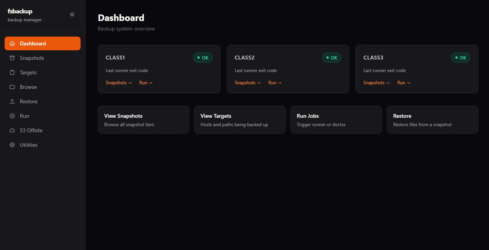
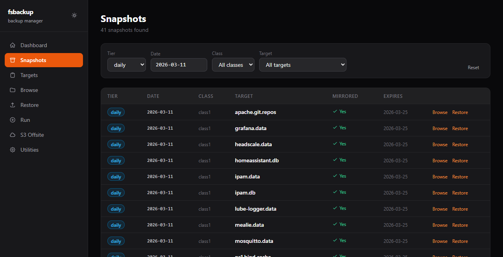
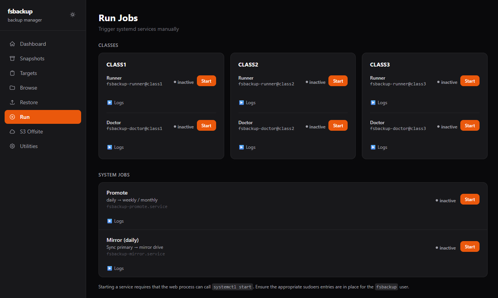
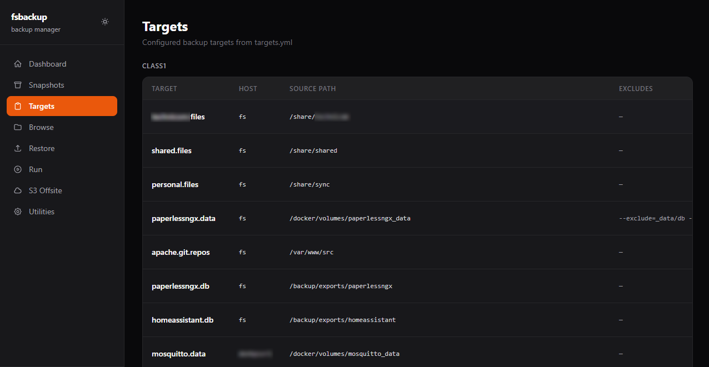
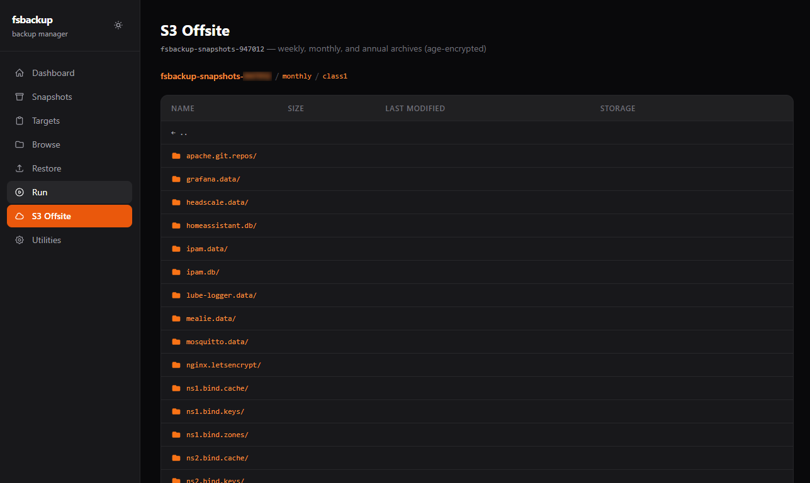
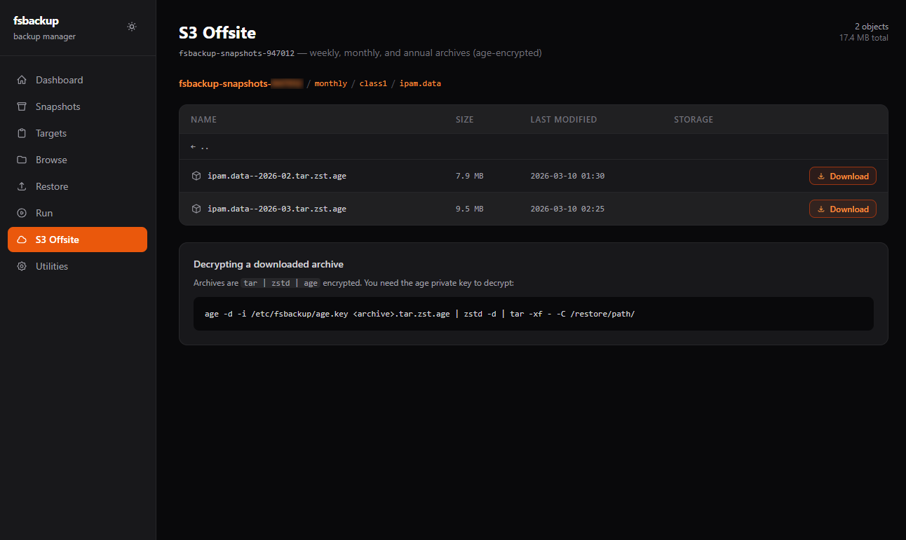
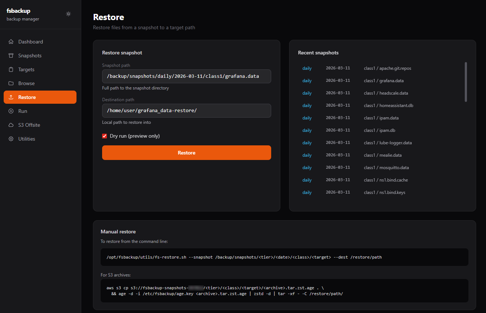
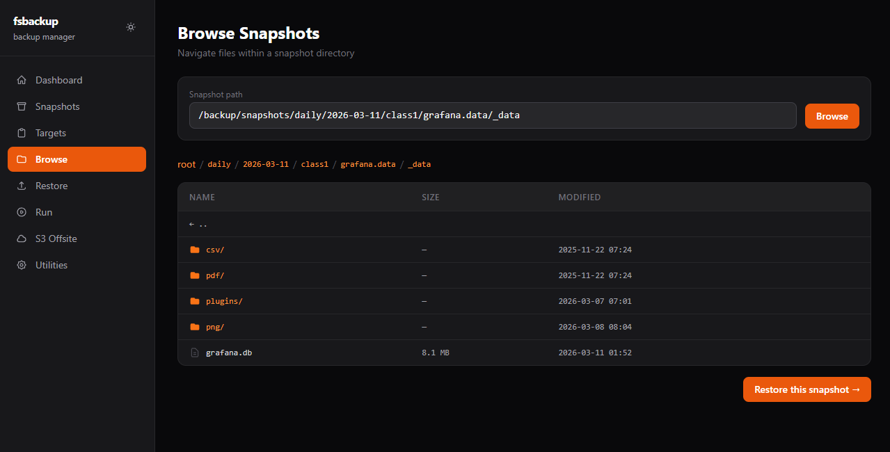

# fsbackup web UI

A lightweight read-mostly admin interface for the fsbackup system. Built with
FastAPI, HTMX, and Tailwind CSS. Runs as a systemd service on the backup server.

## Contents

- [Architecture](#architecture)
- [Pages and routes](#pages-and-routes)
- [How scripts and services are called](#how-scripts-and-services-are-called)
- [Configuration](#configuration)
- [Running locally](#running-locally)
- [Setup](#setup)
- [Permissions](#permissions)
- [Deploying as a systemd service](#deploying-as-a-systemd-service)
- [Dark / light mode](#dark--light-mode)
- [Extending the UI](#extending-the-ui)
- [Screenshots](#screenshots)

---

## Architecture

```
web/
  main.py              # FastAPI application — all routes and business logic
  requirements.txt     # Python dependencies
  .env.example         # Configuration template (copy to .env)
  static/              # Static assets (currently empty; Tailwind and HTMX are CDN)
  templates/
    base.html            # Shared layout: sidebar nav, dark/light toggle, CDN scripts
    index.html           # Dashboard
    snapshots.html       # Snapshot browser with live HTMX filters
    targets.html         # targets.yml viewer (also accessible via Configuration > Targets)
    targets_edit.html    # Raw targets.yml editor
    browse.html          # Filesystem browser inside a snapshot
    restore.html         # Restore form
    run.html             # Trigger runner/doctor jobs; live status + log tail
    logs.html            # Logs page: Live tab (log panels + metrics) and History tab
    s3.html              # S3 offsite bucket browser
    configuration.html   # Tabbed configuration page (Hosts, Targets, Schedule, Volumes)
    utilities.html       # Stub — redirects to Configuration and Restore
    partials/
      snapshot_rows.html   # HTMX swap target: snapshot table body
      dir_entries.html     # HTMX swap target: directory listing rows
      run_result.html      # HTMX swap target: inline start/error badge
      journal.html         # Log viewer body (Live panels, reused by the History viewer)
      log_history.html     # Logs > History tab body (sources, file list, viewer slots)
      log_history_files.html  # HTMX swap target: one source's log files by date
      log_history_view.html   # HTMX swap target: one log file in the viewer
      log_history_placeholder.html  # Empty History viewer shown before a date is picked
```

### Stack

| Layer     | Technology | Notes |
|-----------|-----------|-------|
| Backend   | [FastAPI](https://fastapi.tiangolo.com/) | Async Python, served by uvicorn |
| Templates | [Jinja2](https://jinja.palletsprojects.com/) | Server-rendered HTML |
| Interactivity | [HTMX](https://htmx.org/) 1.9 | Swaps HTML fragments without a JS framework |
| Styles    | [Tailwind CSS](https://tailwindcss.com/) 3 (CDN) | No build step required |
| S3 client | [boto3](https://boto3.amazonaws.com/v1/documentation/api/latest/index.html) | Uses the `fsbackup` AWS profile |

Tailwind and HTMX are loaded from CDN in `base.html`. There is no frontend build
step and no Node.js requirement.

---

## Pages and routes

| Route | Page | Description |
|-------|------|-------------|
| `GET /` | Dashboard | Class status cards read from `.prom` metric files |
| `GET /snapshots` | Snapshots | Filterable table of all local snapshots; defaults to daily tier + today |
| `GET /restore` | Restore | Restore form with recent-snapshot quick-select sidebar |
| `GET /run` | Run | Trigger runner/doctor per class; live status + log tail |
| `GET /logs` | Logs | Live tab: per-job log panels + Prometheus metrics. History tab (`?tab=history`): rotated log files by date |
| `GET /s3` | S3 Offsite | Prefix-based S3 bucket browser with presigned download |
| `GET /configuration` | Configuration | Tabbed page: Hosts, Targets, Schedule, Volumes & Maintenance |
| `GET /targets` | Targets | Parsed view of `/etc/fsbackup/targets.yml` (also in Configuration > Targets tab) |
| `GET /targets/edit` | Edit Targets | Raw `targets.yml` editor |
| `GET /browse` | Browse | Directory tree walker inside a snapshot path (linked from Snapshots page) |
| `GET /utilities` | Utilities | Stub page — redirects to Configuration and Restore |

### Configuration page tabs

| Tab | Description |
|-----|-------------|
| Hosts | Lists all unique hosts from `targets.yml` with SSH host key trust state; scan a host, verify its fingerprint, and trust it (`fs-trust-host.sh --scan` / `--expect`, runs as fsbackup — no sudo) |
| Targets | Targets table grouped by class; link to edit `targets.yml`; rename instructions via `fs-target-rename.sh` |
| Schedule | Read-only view of the systemd timers — runner schedules from `fsbackup.conf` plus the fixed timers — with their `OnCalendar` expressions |
| Volumes & Maintenance | ZFS usage for the snapshot root, per-target dataset sizes, and S3 bucket object count/size; node exporter troubleshooting |

### Logs page tabs

| Tab | Description |
|-----|-------------|
| Live (`/logs`) | One collapsible panel per job showing the last lines of its log (current file + newest rotated one), with auto-refresh and pop-out; Prometheus metrics table |
| History (`/logs?tab=history`) | Pick a source (backup / doctor per class, orphans, retention, S3 export, ZFS scrub), then a date: every rotated file logrotate keeps, newest first, opened in the log viewer with Older/Newer navigation and a raw download. `&source=<key>&date=<YYYYMMDD\|current>` deep-links to a file |

### HTMX partial endpoints

| Route | Returns | Triggered by |
|-------|---------|--------------|
| `GET /api/snapshots` | `partials/snapshot_rows.html` | Filter change on `/snapshots` |
| `GET /api/tier-dates` | `<datalist>` HTML | Tier dropdown change on `/snapshots` |
| `GET /api/browse` | `partials/dir_entries.html` | *(reserved for future lazy tree)* |
| `GET /api/s3/download?key=…` | Redirect to presigned URL | Download button on `/s3` |
| `POST /api/run/{action}` | `partials/run_result.html` | Start buttons on `/run` |
| `GET /api/journal/{unit}` | `partials/journal.html` | Log panels on `/logs` (Live) and `/run` |
| `GET /api/logs/history/{source}` | `partials/log_history_files.html` | Source click on `/logs?tab=history` |
| `GET /api/logs/history/{source}/{date}[?all=1]` | `partials/log_history_view.html` | Date click, Older/Newer, Show all |
| `GET /api/logs/history/{source}/{date}/download` | The raw file (attachment) | Download button in the History viewer |

---

## How scripts and services are called

### Jobs (Run page)

`POST /api/run/{action}` spawns the relevant `bin/` script **directly** as a
subprocess (`fs-runner.sh` / `fs-doctor.sh`) — there is no `systemctl` or systemd
dependency. Output is streamed into an in-memory buffer and polled by the page via
`GET /api/run/status`. Because the scripts run as the same user as the web process
(`fsbackup`), no sudo is needed for runner/doctor.

Two actions do use `sudo` via scoped drop-ins:

- **Orphan delete** (`POST /api/orphans/delete`) → `sudo zfs destroy -r <dataset>`
  (`/etc/sudoers.d/fsbackup-zfs-destroy`).
- **Rename target** (`POST /api/run/rename-target`) → `sudo fs-target-rename.sh …`.

### S3 (S3 Offsite page)

Uses boto3 with the `fsbackup` AWS profile (`/var/lib/fsbackup/.aws/credentials`).
`ListObjectsV2` is used to browse prefixes. Downloads generate a **presigned URL**
via `generate_presigned_url("get_object", ...)` — the browser fetches directly from
S3, nothing is proxied through the web server.

Presigned URLs expire after `PRESIGN_TTL` seconds (default: 3600).

### Restore (Restore page)

`POST /api/run/restore` runs rsync directly. The snapshot path is resolved and
validated to be within `SNAPSHOT_ROOT` before execution. Dry-run mode
(default: on) passes `--dry-run --stats` to rsync and displays a preview without
modifying any files.

**Restore to → Remote host** pushes to `backup@<host>:<path>` with
`rsync --mkpath -e "ssh -o BatchMode=yes -o StrictHostKeyChecking=yes"` (as the
`fsbackup` user, with the runner's SSH key). Only hosts from `targets.yml` with a
trusted host key are offered; the path must be absolute, use a conservative
charset, and contain no `..`. The remote `backup` user can only write where its
permissions allow (e.g. `/var/tmp/…`), so restore to a staging directory.

### Logs (Logs page)

Both tabs read the job log files directly from `LOG_DIR`, resolved once at startup
by `_resolve_log_dir()`. The web user only needs read access, and nothing runs through
sudo or a shell.

The **History** tab lists `<source>.log`, `<source>.log-YYYYMMDD` and
`<source>.log-YYYYMMDD.gz` (logrotate `dateext`). A file is dated the day it was
rotated, just after midnight, so it mostly covers the day before. The list's
*Starts* column shows each file's first timestamp.

- **Path safety:** requests carry only a source key from a fixed allow-list and a
  date (`YYYYMMDD` or `current`). Filenames come from scanning `LOG_DIR`, never
  from the request. Only regular files are listed, files are opened with
  `O_NOFOLLOW` and `O_NONBLOCK` and must still be regular files once open, and
  anything else gets 400/404 with no paths in the error.
- **Live tab** reads its files the same way: a symlink, FIFO or other non-regular
  file in `LOG_DIR` is ignored, as if the file weren't there (the panel then falls
  back to the journal).
- **Deep links** (`/logs?tab=history&source=…&date=…`) survive the login redirect:
  the `next` parameter keeps the query string.
- **`.gz` files** are decompressed in memory while streaming, with Python's `gzip`.
  Nothing is extracted to disk.
- **Size limits:** the viewer renders the last 5,000 lines. *Show all* renders up to
  100,000; beyond that, use the download.
- **Download** returns the file exactly as stored. A `.gz` is sent compressed
  (`application/gzip`, `.gz` filename, no `Content-Encoding`), so the browser saves
  it rather than inflating it; open it with `zless`.

---

## Configuration

A `.env` file is **optional**. All variables have defaults baked into `main.py`
via `os.environ.get("VAR", "default")`, so the app starts with no configuration
at all and the defaults match a standard fsbackup installation.

Only create a `.env` if you need to override something:

```bash
cp web/.env.example web/.env
# edit web/.env as needed
```

The app loads `web/.env` automatically at startup via `python-dotenv`. When
running under systemd, you can use `EnvironmentFile=` in the unit file instead.

| Variable | Default | Description |
|----------|---------|-------------|
| `HOST` | `0.0.0.0` | Address to bind to |
| `PORT` | `8080` | Port to listen on |
| `SNAPSHOT_ROOT` | `/backup/snapshots` | ZFS snapshot root |
| `TARGETS_FILE` | `/etc/fsbackup/targets.yml` | targets.yml path |
| `FSBACKUP_LOG_DIR` | *(unset)* | Log directory for the Logs page. Unset = `LOG_DIR` read from `/etc/fsbackup/fsbackup.conf` (a literal path; the file is parsed, not executed), else `/var/log/fsbackup` |
| `S3_BUCKET` | `fsbackup-snapshots-SUFFIX` | S3 bucket name |
| `S3_PROFILE` | `fsbackup` | AWS credentials profile name |
| `S3_REGION` | `us-west-2` | AWS region |
| `PRESIGN_TTL` | `3600` | Presigned download URL expiry (seconds) |
| `AUTH_ENABLED` | `true` | Require login (set `false` only on a trusted network) |
| `AUTH_PASSWORD_HASH` | *(unset)* | bcrypt hash of the login password (generated by `web/install.sh`) |
| `AUTH_USERNAME` | *(unset)* | If set, the login username must match this too; empty = any username accepted |
| `SECRET_KEY` | *(random)* | Session-cookie signing key; set a stable value to keep sessions across restarts |
| `SESSION_COOKIE_SECURE` | `false` | Mark the session cookie `Secure` when served over HTTPS |
| `PROXY_TRUSTED_IPS` | *(unset)* | Reverse-proxy IP(s) whose `X-Forwarded-*` headers to trust (comma-separated, or `*`); makes the login throttle see real client IPs |

> `HOST` and `PORT` are read by the `if __name__ == "__main__"` entrypoint in
> `main.py`. If you start the app via `uvicorn main:app` directly on the command
> line, pass `--host` and `--port` explicitly or export the variables first.

### Behind a reverse proxy

When the UI is served through a reverse proxy (TLS termination, an internal
hostname, etc.), set two things in `web/.env`:

```bash
PROXY_TRUSTED_IPS=10.0.0.5     # the proxy's IP; the app trusts its X-Forwarded-* headers
SESSION_COOKIE_SECURE=true     # the browser leg is HTTPS
```

`PROXY_TRUSTED_IPS` makes `request.client.host` the real client IP, so the login
throttle buckets per client instead of locking out everyone behind the proxy. The
proxy must forward the original **Host** header (the CSRF check compares it against
the request's `Origin`), plus `X-Forwarded-For` and `X-Forwarded-Proto`. For nginx:

```nginx
proxy_set_header Host              $host;
proxy_set_header X-Forwarded-For   $proxy_add_x_forwarded_for;
proxy_set_header X-Forwarded-Proto $scheme;
```

---

## Running locally

```bash
cd /opt/fsbackup/web
pip install -r requirements.txt

# Simplest — uses all defaults, no .env needed:
uvicorn main:app --reload

# Or via the entrypoint, which reads HOST/PORT from .env:
python3 main.py
```

The `--reload` flag restarts on file changes — remove it in production.

---

## Setup

Run `web/install.sh` as root to configure permissions, generate `.env`, install
dependencies, and optionally install the systemd service:

```bash
sudo bash /opt/fsbackup/web/install.sh
```

The script will:
1. Ask which user will run the web UI
2. Add that user to the `fsbackup` group (covers snapshot dirs and config files)
3. Apply ACLs for paths not covered by the group (Prometheus textfile dir, AWS credentials)
4. Add that user to the `systemd-journal` group (needed for the log viewer on the Run page)
5. Generate a `web/.env` with a random `SECRET_KEY`, prompting for host/port and auth settings
6. Create the Python venv and install dependencies
7. Optionally write and enable a systemd unit

## Permissions

The `fsbackup` group covers the main paths the app needs. `web/install.sh` handles
this automatically. If you need to understand or redo it manually:

| Path | Access needed | Covered by |
|------|--------------|------------|
| `/backup/snapshots` | read + traverse | `fsbackup` group |
| `/etc/fsbackup/` | read + traverse | `fsbackup` group |
| `/var/log/fsbackup/` (`LOG_DIR`) | read + traverse | `fsbackup` group (dir is `fsbackup:fsbackup` 0750) |
| `/var/lib/node_exporter/textfile_collector/` | read | ACL (set by `web/install.sh`) |
| `/var/lib/fsbackup/.aws/` | read | ACL (set by `web/install.sh`) |
| systemd journal | read | `systemd-journal` group (set by `web/install.sh`) |

The app sets `AWS_SHARED_CREDENTIALS_FILE` and `AWS_CONFIG_FILE` to point at
`/var/lib/fsbackup/.aws/` at startup, so boto3 finds the `fsbackup` AWS profile
regardless of which user runs the process.

---

## Deploying as a systemd service

The easiest way is to let `web/install.sh` write and install the unit for you — it
prompts during setup and uses the correct user, paths, and `.env` location.

To do it manually, create `/etc/systemd/system/fsbackup-web.service`:

```ini
[Unit]
Description=fsbackup web UI
After=network.target

[Service]
Type=simple
User=fsbackup
WorkingDirectory=/opt/fsbackup/web
ExecStart=/opt/fsbackup/web/.venv/bin/python3 /opt/fsbackup/web/main.py
EnvironmentFile=/opt/fsbackup/web/.env
Restart=on-failure
RestartSec=5

[Install]
WantedBy=multi-user.target
```

Then:

```bash
sudo systemctl daemon-reload
sudo systemctl enable --now fsbackup-web.service
```

---

## Dark / light mode

The toggle button in the top-right of the sidebar switches between dark and light
mode. The preference is saved in `localStorage` and applied before first paint to
avoid a flash.

---

## Extending the UI

- **New page**: add a route in `main.py`, create `templates/<page>.html` extending
  `base.html`, add the nav entry to the `nav` list in `base.html`.
- **New HTMX partial**: add a `GET /api/...` route returning a
  `TemplateResponse("partials/<name>.html", ...)`, target it with `hx-get` and
  `hx-target` in the calling template.
- **New utility or maintenance tool**: add a card or section to the appropriate
  tab in `configuration.html`, and a `POST /api/run/<action>` handler in `main.py`
  that calls the relevant script in `utils/`.

---

## Screenshots

 

 

 

 
